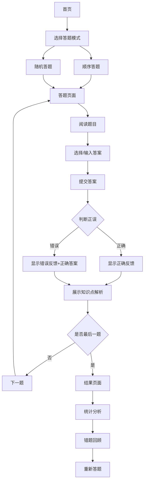

## 1. Product Overview
AI基础A在线答题网站，为学生提供便捷的复习和自测平台。通过完整导入200+道复习题库，支持选择题和填空题两种题型，提供即时正误判断和知识点解析，帮助用户高效备考。

## 2. Core Features

### 2.1 User Roles
| Role | Registration Method | Core Permissions |
|------|---------------------|------------------|
| User | No registration required | Browse questions, take quizzes, view analysis |

### 2.2 Feature Module
1. **首页**: 展示题库概览、开始答题入口、答题进度统计
2. **答题页面**: 题目展示、选项选择、答案提交、即时反馈、知识点解析
3. **结果页面**: 答题统计、正确率分析、错题回顾

### 2.3 Page Details
| Page Name | Module Name | Feature description |
|-----------|-------------|---------------------|
| 首页 | 题库概览 | 显示题目总数、选择题/填空题数量、用户答题进度 |
| 首页 | 开始答题 | 支持顺序答题和随机答题两种模式 |
| 答题页面 | 题目展示 | 清晰展示题目内容、选项（选择题）或输入框（填空题） |
| 答题页面 | 答案提交 | 一键提交，即时显示正误判断 |
| 答题页面 | 知识点解析 | 答题后展示详细解析和关联知识点 |
| 答题页面 | 导航控制 | 上一题/下一题切换、题目序号跳转 |
| 结果页面 | 统计分析 | 总答题数、正确数、正确率、用时统计 |
| 结果页面 | 错题回顾 | 列出所有答错的题目，支持重新答题 |

## 3. Core Process

用户进入首页 → 选择答题模式 → 进入答题页面 → 阅读题目并作答 → 提交答案 → 查看即时反馈和解析 → 继续下一题 → 完成所有题目 → 查看结果统计

## 4. User Interface Design

### 4.1 Design Style
- **主色调**: 深蓝色(#1e40af)作为主色，配合浅蓝色渐变，体现科技感和专业性
- **辅助色**: 绿色(#16a34a)表示正确，红色(#dc2626)表示错误，黄色(#d97706)表示警告
- **按钮风格**: 圆角矩形，hover时有阴影和缩放效果
- **字体**: 使用Inter字体，标题加粗，正文清晰易读
- **布局**: 卡片式布局，题目内容居中展示，选项垂直排列
- **图标**: 使用Lucide图标库，简洁现代

### 4.2 Page Design Overview
| Page Name | Module Name | UI Elements |
|-----------|-------------|-------------|
| 首页 | 头部导航 | Logo、网站标题、进度指示器 |
| 首页 | 题库卡片 | 统计数据展示（题目数、正确率、答题数） |
| 首页 | 开始按钮 | 大型CTA按钮，带动画效果 |
| 答题页面 | 题目卡片 | 题目序号、题型标识、题目内容 |
| 答题页面 | 选项区域 | 选择题：radio按钮+选项文本；填空题：输入框 |
| 答题页面 | 反馈区域 | 正确/错误图标、提示文字 |
| 答题页面 | 解析区域 | 可折叠的知识点解析卡片 |
| 答题页面 | 底部导航 | 上一题、提交答案、下一题按钮 |
| 结果页面 | 统计卡片 | 圆环进度条展示正确率、详细统计数据 |
| 结果页面 | 错题列表 | 可展开的错题卡片，显示答案和解析 |

### 4.3 Responsiveness
- **桌面端**: 最大宽度1200px，题目卡片居中，两侧有留白
- **平板端**: 自适应宽度，卡片占满屏幕宽度
- **移动端**: 卡片全屏展示，选项改为纵向排列，字体大小调整

### 4.4 3D Scene Guidance
不适用