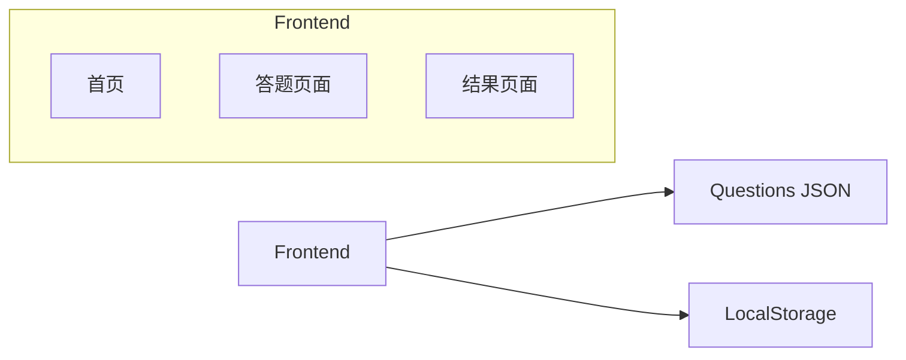
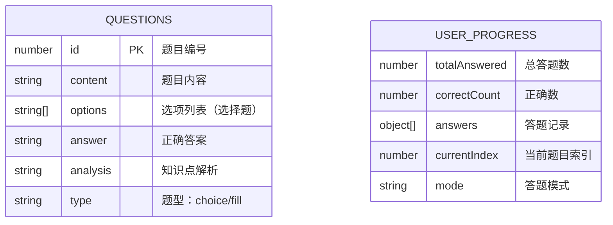

## 1. Architecture Design



## 2. Technology Description
- Frontend: React@18 + TypeScript + TailwindCSS@3 + Vite
- State Management: Zustand
- Icons: Lucide React
- Data Source: JSON file (questions.json)
- Data Persistence: LocalStorage (答题进度和历史记录)

## 3. Route Definitions
| Route | Purpose |
|-------|---------|
| / | 首页，展示题库概览和开始答题入口 |
| /quiz | 答题页面，展示题目和答题交互 |
| /result | 结果页面，展示答题统计和错题回顾 |

## 4. API Definitions
无后端API，所有数据从本地JSON文件加载

## 5. Server Architecture Diagram
不适用（纯前端应用）

## 6. Data Model

### 6.1 Data Model Definition



### 6.2 Data Definition Language

**Questions JSON结构:**
```typescript
interface Question {
    id: number;
    content: string;
    options: string[];
    answer: string;
    analysis: string;
    type: 'choice' | 'fill';
}
```

**User Progress LocalStorage结构:**
```typescript
interface UserProgress {
    totalAnswered: number;
    correctCount: number;
    answers: { questionId: number; userAnswer: string; isCorrect: boolean }[];
    currentIndex: number;
    mode: 'sequential' | 'random';
}
```